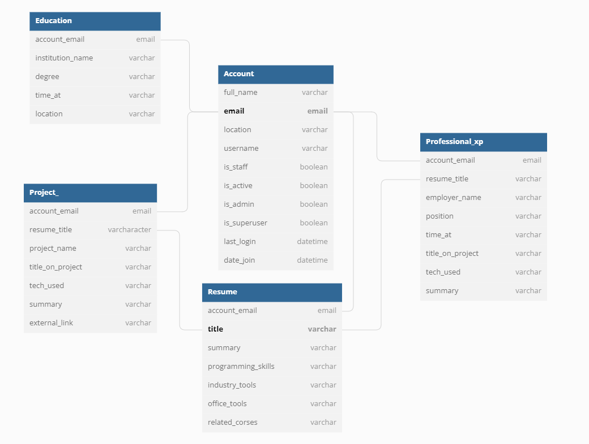

# django rest framework based Resume System
A django REST framework based system that is easy to deploy allowing the user to solely focus on frontend hook up and design. The system can host a multitude of resumes from a multitude of users. 

ideal would be single page app?????

## Relational map for django ORM

To add and edit to this map; copy the contents of ./Backend_Design/DB_scheme_resume_site_v_1_1.txt and paste it [here](https://dbdiagram.io/d).

## Rapid Deployment  
For rapid deployment link this project to a Heroku app

## To-Do
- [ ] Explain how to deploy on heroku.
- [ ] Enviorment variables on the heroku enviorment.
- [ ] API endpoint that need to be refrenced in the front endpoint.
- [ ] Explain initial setup after deployment.

